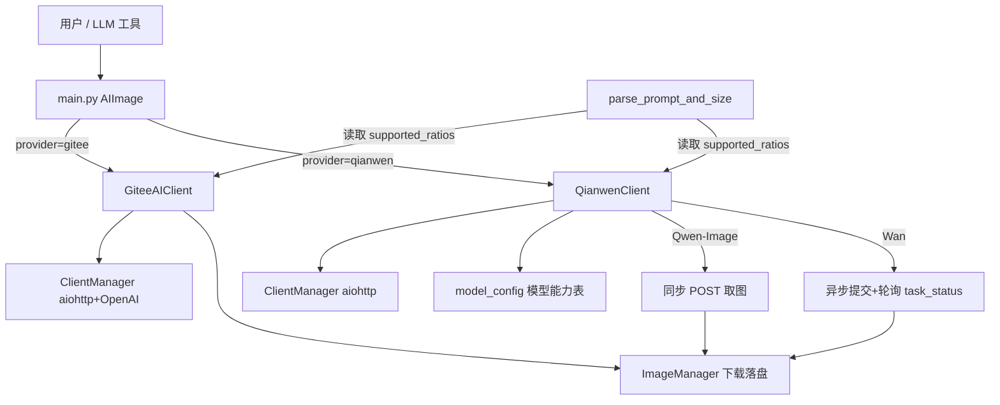

## 产品概述

为 AstrBot 插件 `astrbot_plugin_models_ai` 新增**千问云（Qwen / DashScope）文生图**服务商支持，使其与现有的 Gitee AI 并列成为可选服务商。用户通过全局配置项 `provider` 在二者之间切换，切换后所有生图入口（命令行生了图命令、LLM 生图工具）统一走当前选中的服务商。

## 功能内容

- **服务商切换**：新增顶层配置项 `provider`（`gitee` / `qianwen`，默认 `gitee`）。选 `qianwen` 后，`/ai-gitee generate` 命令与 LLM 工具 `draw_image` 均调用千问云接口。
- **同步生图链路**：支持 Qwen-Image 系列（如 `qwen-image-plus`、`qwen-image-max`、`qwen-image-3.0` 系列、`qwen-image-2.0` 系列）一次请求直接返回图片。
- **异步生图链路**：支持 Wan 系列（如 `wan2.7-image-pro`、`wan2.6-t2i`、`wan2.5-t2i-preview`），采用「提交任务 → 轮询 `task_status` → 取回图片」的完整链路。
- **模型差异自适应**：按模型能力自动裁剪参数——`wan2.7-image-pro` / `wan2.7-image` 不支持 `negative_prompt` 与 `prompt_extend`；Wan 2.5 及更早版本需用 `input.prompt` 传提示词；`qwen-image-plus` / `qwen-image-max` 仅接受固定档分辨率。
- **比例参数**：延续现有「提示词 + 比例」用法（如 `9:16`），按千问的 `宽*高` 星号格式映射到对应服务商推荐的分辨率。
- **多 Key 轮询**：千问 API Key 沿用现有多 Key 轮询机制，兼容「逗号分隔字符串」与「列表」两种配置写法。

## 范围边界

- 本次**仅实现文生图**；图像编辑（`ai-edit`）、风格转换保持 Gitee 现有实现不变。
- 不改动现有 `/ai-gitee` 命令组结构与命令名。
- Wan 2.7 专有参数（`thinking_mode`、`enable_sequential`、`color_palette`）不纳入本次实现。

## 技术栈选型

- **语言**：Python 3.12+（沿用项目现状，需带类型注解并通过 mypy `ignore-missing-imports`）
- **HTTP 客户端**：复用现有 `aiohttp`（`ClientManager.get_http_session()`）
- **关键约束**：千问文生图为 **DashScope 原生接口**，官方文档明确「**不支持 OpenAI 兼容（compatible-mode）模式**」，因此**不能**复用插件现有的 `AsyncOpenAI` 调用；采用原生 REST + aiohttp，**不新增 `dashscope` SDK 依赖**，保持 `requirements.txt` 不变。

## 实现思路

新增一层 `qianwen/` 服务商模块（与 `gitee/` 平级），对外暴露与 `GiteeAIClient` **同名同签名的 `generate_image(prompt, size)`**，使命令层/LLM 工具层零改动即可复用；在主入口按 `provider` 配置装配对应客户端。

三条关键设计决策：

1. **以「同名方法」而非「抽象基类」实现多态的命令层复用**。项目现有调用点统一为 `await plugin.api_client.generate_image(prompt, size=target_size)`，引入基类会牵动 `GiteeAIClient` 全部方法签名（含 `edit_image`，本次不改），性价比低且违背「局部精准修改」。故采用鸭子类型契约 + 类型注解说明。
2. **`supported_ratios` 下沉到客户端**，解开 `parse_prompt_and_size` 对全局 `SUPPORTED_RATIOS` 的硬依赖。这是本次唯一必须触碰的核心文件，改动面控制在 3 行常量读取。
3. **模型能力表驱动参数裁剪**。千问各模型对 `negative_prompt` / `prompt_extend` / 提示词字段 / 分辨率的支持差异极大，散落在分支里会迅速腐化；用一张声明式的 `QianwenModelSpec` 表集中表达，并**对未登记模型提供兜底 spec**，保证未来新增模型名不会崩，而是安全降级。

## 实现要点（落地细节）

- **Base URL**：`https://maas.qianwenaiapi.com/api/v1`；鉴权头 `Authorization: Bearer {key}`。
- **REST 路径**（DashScope 标准约定，实现时用真实 Key 冒烟校验）：
- 同步：`POST {base}/services/aigc/multimodal-generation/generation`
- Wan 异步提交：`POST {base}/services/aigc/image-generation/generation`，需带头 `X-DashScope-Async: enable`
- 轮询：`GET {base}/tasks/{task_id}`
- **尺寸格式必须是 `宽*高`（星号）**，如 `2048*2048`；与 Gitee 的 `1024x1024`（字母 x）不兼容，不可混用。
- **尺寸兜底降级**：请求的 size 若落在模型允许范围外（或不在 `qwen-image-plus/max` 的固定档内），**不报错**，降级到该模型默认尺寸并输出 debug 日志，避免用户因比例参数直接失败。
- **异步轮询策略**（对齐官方「前 30 秒每 3 秒轮询，之后逐步延长，设置最终超时」）：前 30 秒间隔 3 秒，之后退避至最大 10 秒；总超时默认 300 秒（官方举例 2 分钟，此处放宽以兼容较慢的人像/4K 出图，且可由配置调整）。每轮轮询输出带轮次的 debug 日志。
- **必须立即下载**：官方明确「图片 URL 在 24 小时后过期，获取结果后应立即下载」，取到 URL 后立刻走 `ImageManager.download_image()` 落盘。
- **错误转译**（AGENTS.md §5.1 强制要求，禁止把原始堆栈抛给用户），在 API 层统一转中文 `RuntimeError`：
- `401/403` → API Key 无效或已过期
- `429` / `Throttling` → 调用次数超限或并发过高
- `DataInspectionFailed` → 提示词未通过内容安全审核（落:ss `logger.error(..., exc_info=True)` 保留完整上下文）
- `5xx` → 千问云服务器内部错误
- 异步任务 `FAILED/CANCELED` → 带上 `task_id` 与服务端 `code/message`
- **资源与性能**：`n` 固定为 1（官方「测试阶段建议 n 设为 1」，且避免重复计费）；沿用现有「每 `CLEANUP_INTERVAL` 次生成触发一次后台清理 + `_background_tasks` 防 GC」范式；`close()` 复用 `ClientManager.close()`。千问不使用 `get_openai_client()`，因此不会创建多余的 httpx 客户端。
- **日志规范**：统一 `plugin.debug_log()` / `logger`，禁止 `print()`；Key 只打印前 10 位脱敏；所有 `async` 方法 `try/except` 包裹。

## 架构设计



命令层与 LLM 工具层通过统一的 `plugin.api_client.generate_image()` 契约调用；`parse_prompt_and_size` 不再硬编码 `SUPPORTED_RATIOS`，改为读取客户端自身的 `supported_ratios`，使「比例 → 尺寸」映射随服务商自动切换。

## 目录结构

```
/workspace/
├── qianwen/                          # [NEW] 千问云服务商模块（与 gitee/ 平级）
│   ├── __init__.py                   # [NEW] 导出 QianwenClient、get_model_spec 等公共符号
│   ├── api_client.py                 # [NEW] QianwenClient 核心实现：多 Key 轮询、_get_next_api_key、
│   │                                 #        generate_image 统一入口、同步 _generate_sync、
│   │                                 #        异步 _submit_task/_poll_task、_build_parameters 参数裁剪、
│   │                                 #        _resolve_size 尺寸校验与降级、_extract_image_url、错误转译、close
│   └── model_config.py               # [NEW] QianwenModelSpec 数据类 + QIANWEN_MODEL_SPECS 能力表 +
│                                     #       get_model_spec()（含未知模型兜底 spec）。声明每模型的
│                                     #       call_mode(sync/async)、尺寸范围/固定档、prompt 字段、
│                                     #       是否支持 negative_prompt / prompt_extend、n 上限
├── core/
│   ├── config.py                     # [MODIFY] 新增 DEFAULT_QIANWEN_BASE_URL、DEFAULT_QIANWEN_MODEL、
│   │                                 #          DEFAULT_QIANWEN_SIZE、QIANWEN_SUPPORTED_RATIOS（宽*高）、
│   │                                 #          轮询阈值常量（初始间隔/快速窗口/最大间隔/总超时）
│   ├── __init__.py                   # [MODIFY] 同步导出上述新增常量
│   └── command_utils.py              # [MODIFY] parse_prompt_and_size：SUPPORTED_RATIOS →
│                                     #          plugin.api_client.supported_ratios（唯一核心解耦点）
├── gitee/
│   └── api_client.py                 # [MODIFY] GiteeAIClient 增加 supported_ratios 属性 = SUPPORTED_RATIOS，
│                                     #          保持既有行为完全不变
├── main.py                           # [MODIFY] __init__ 按 provider 装配 GiteeAIClient / QianwenClient；
│                                     #          千问分支使用千问默认值（模型/尺寸），Gitee 分支逻辑原样保留
├── _conf_schema.json                 # [MODIFY] 新增 provider（string，默认 gitee）、qianwen_api_key（list）、
│                                     #          qianwen_prompt_extend（bool，默认 true）；补充说明
│                                     #          model/size/negative_prompt 为跨服务商共用 + 千问专用说明
├── README.md                         # [MODIFY] 补充千问云配置与使用说明、支持模型清单
└── commands/
    └── help.py                       # [MODIFY] 帮助文本补充当前服务商与千问模型说明
```

## 关键代码结构

模型能力表契约（`qianwen/model_config.py`），多模块依赖，需精确定义：

```python
@dataclass(frozen=True)
class QianwenModelSpec:
    """千问文生图模型的调用能力描述。"""
    call_mode: str                      # "sync" | "async"，决定走同步取图还是异步轮询
    default_size: str                   # 该模型默认尺寸，格式 "宽*高"
    min_side: int                       # 单边最小像素（固定档模型填 0）
    max_side: int                       # 单边最大像素（固定档模型填 0）
    max_n: int                          # 单次允许的最大生成数量
    supports_negative_prompt: bool      # wan2.7-image-pro / wan2.7-image 为 False
    supports_prompt_extend: bool        # wan2.7-image-pro / wan2.7-image 为 False
    prompt_field: str = "messages"      # "messages"（新模型）| "prompt"（Wan 2.5 及更早）
    fixed_sizes: tuple[str, ...] | None = None   # qwen-image-plus / max 仅接受固定档

    def supports_size(self, size: str) -> bool: ...
    def resolve_size(self, size: str) -> str: ...   # 越界或不在固定档时返回 default_size

def get_model_spec(model: str) -> QianwenModelSpec:
    """按模型名取能力描述；未登记模型返回保守兜底 spec（sync、512–2048、n=1、支持负向/改写）。"""
```

客户端对外契约（`qianwen/api_client.py`），需与 `GiteeAIClient` 保持一致：

```python
class QianwenClient:
    supported_ratios: dict[str, list[str]]      # 供 parse_prompt_and_size 使用
    model: str                                  # 供 switch_model 命令读写
    default_size: str

    async def generate_image(self, prompt: str, size: str = "") -> str: ...
    async def close(self) -> None: ...
```

## 智能体扩展

### Skill

- **lsp-code-analysis**
- 用途：在实现 `parse_prompt_and_size` 解耦改造前，用符号引用（references）精确定位所有依赖 `SUPPORTED_RATIOS` 的调用点，避免遗漏命令层隐式引用。
- 预期结果：得到 `SUPPORTED_RATIOS` 与 `api_client.default_size` 的完整引用清单，确认改造零遗漏、零副作用。