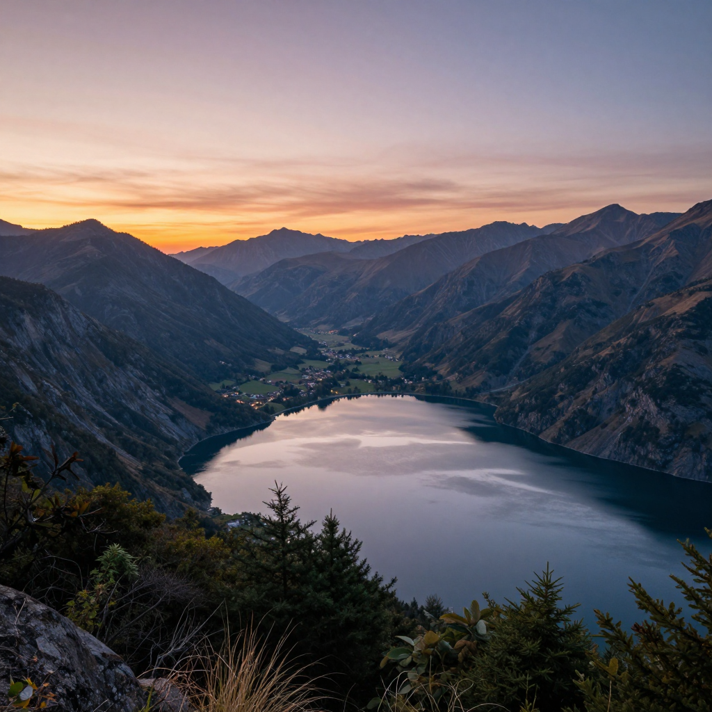

# 出图展示区

本文档展示了各种风格的图片生成示例和提示词技巧，帮助您更好地使用插件生成高质量图片。

## 目录

- [概述](#概述)
- [提示词基础](#提示词基础)
- [风格示例](#风格示例)
- [场景示例](#场景示例)
- [提示词技巧](#提示词技巧)
- [高级技巧](#高级技巧)
- [常见问题](#常见问题)
- [相关文档](#相关文档)

## 概述

本文档通过实际示例展示如何使用插件生成各种风格的图片，包括：

- 🎨 不同艺术风格的生成示例
- 📷 不同摄影风格的生成示例
- 👤 人物肖像的生成示例
- 🌄 风景画的生成示例
- 🐱 动物绘画的生成示例
- 🏙️ 城市景观的生成示例

每个示例都包含：
- 提示词（中文和英文）
- 生成命令
- 效果说明
- 提示词分析

## 提示词基础

### 提示词结构

一个好的提示词应该包含以下要素：

```
主体 + 动作 + 场景 + 风格 + 细节 + 质量
```

### 基本示例

#### 示例 1：简单提示词

**中文**：
```
一只猫
```

**英文**：
```
a cat
```

**问题**：太简单，生成的图片可能不够具体。

#### 示例 2：优化后的提示词

**中文**：
```
一只可爱的橘色猫咪，坐在窗台上，阳光透过窗户洒在它身上，毛茸茸的毛发闪闪发光，背景是蓝天白云，高质量，8K，细节丰富
```

**英文**：
```
a cute orange tabby cat sitting on a windowsill, sunlight streaming through the window illuminating its fluffy fur, background is blue sky and white clouds, high quality, 8K, highly detailed
```

**优点**：包含主体、动作、场景、光线、质量描述。

### 质量关键词

| 关键词               | 说明     | 适用场景 |
|-------------------|--------|------|
| `high quality`    | 高质量    | 通用   |
| `8K`              | 8K 分辨率 | 追求细节 |
| `highly detailed` | 高度细节   | 细节丰富 |
| `masterpiece`     | 杰作     | 艺术作品 |
| `best quality`    | 最佳质量   | 通用   |
| `ultra detailed`  | 超级细节   | 极致细节 |

### 风格关键词

| 关键词              | 说明    | 适用场景 |
|------------------|-------|------|
| `anime style`    | 动漫风格  | 二次元  |
| `realistic`      | 写实风格  | 真实感  |
| `oil painting`   | 油画风格  | 艺术绘画 |
| `watercolor`     | 水彩风格  | 柔和艺术 |
| `digital art`    | 数字艺术  | 现代艺术 |
| `cinematic`      | 电影感   | 影视效果 |
| `photorealistic` | 照片级写实 | 真实照片 |

### 光线关键词

| 关键词                 | 说明    | 适用场景 |
|---------------------|-------|------|
| `soft lighting`     | 柔和光线  | 温柔氛围 |
| `golden hour`       | 黄金时刻  | 日出日落 |
| `dramatic lighting` | 戏剧性光线 | 强对比  |
| `natural light`     | 自然光   | 真实感  |
| `studio lighting`   | 工作室光线 | 专业摄影 |
| `backlight`         | 逆光    | 轮廓效果 |

## 风格示例

### 动漫风格

#### 示例 1：动漫女孩


**中文提示词**：
```
一个穿着白色连衣裙的女孩，站在樱花树下，粉色长发，蓝色眼睛，微笑，柔和的阳光透过花瓣洒在她身上，动漫风格，高质量，8K
```

**英文提示词**：
```
a girl wearing a white dress standing under cherry blossom trees, pink long hair, blue eyes, smiling, soft sunlight filtering through petals, anime style, high quality, 8K
```

**生成命令**：
```
/ai-gitee generate 一个穿着白色连衣裙的女孩，站在樱花树下，粉色长发，蓝色眼睛，微笑，柔和的阳光透过花瓣洒在她身上，动漫风格，高质量，8K 3:4
```

**效果说明**：
- ✅ 人物形象清晰，符合动漫风格
- ✅ 光线柔和，营造出梦幻氛围
- ✅ 色彩鲜艳，细节丰富
- ✅ 比例 3:4 适合人像展示

**提示词分析**：
- 主体：一个穿着白色连衣裙的女孩
- 场景：樱花树下
- 外貌：粉色长发，蓝色眼睛
- 表情：微笑
- 光线：柔和的阳光透过花瓣
- 风格：动漫风格
- 质量：高质量，8K

---

#### 示例 2：Q版风格

**中文提示词**：
```
Q版风格的可爱猫咪，大大的眼睛，圆圆的脸，毛茸茸的身体，坐在窗台上，阳光洒在身上，超级可爱，高质量
```

**英文提示词**：
```
chibi style cute cat, big eyes, round face, fluffy body, sitting on windowsill, sunlight shining on it, super cute, high quality
```

**生成命令**：
```
/ai-gitee style Q版化 一只可爱的猫咪
```

**效果说明**：
- ✅ Q版比例，头大身小
- ✅ 可爱的大眼睛
- ✅ 毛茸茸的质感
- ✅ 色彩明亮活泼

**提示词分析**：
- 风格：Q版风格
- 特征：大大的眼睛，圆圆的脸
- 质感：毛茸茸的身体
- 场景：坐在窗台上
- 光线：阳光洒在身上
- 氛围：超级可爱

---

### 写实风格

#### 示例 1：写实人像


**中文提示词**：
```
一个年轻女性的写实肖像，站在现代城市街道上，穿着简约的白色T恤和蓝色牛仔裤，自然光线，柔和的阴影，照片级写实，高质量，8K
```

**英文提示词**：
```
realistic portrait of a young woman standing on a modern city street, wearing simple white t-shirt and blue jeans, natural light, soft shadows, photorealistic, high quality, 8K
```

**生成命令**：
```
/ai-gitee generate 一个年轻女性的写实肖像，站在现代城市街道上，穿着简约的白色T恤和蓝色牛仔裤，自然光线，柔和的阴影，照片级写实，高质量，8K 3:4
```

**效果说明**：
- ✅ 真实的人物比例和特征
- ✅ 自然的皮肤纹理
- ✅ 真实的光影效果
- ✅ 符合现实场景

**提示词分析**：
- 主体：年轻女性的写实肖像
- 场景：现代城市街道
- 服装：简约的白色T恤和蓝色牛仔裤
- 光线：自然光线，柔和的阴影
- 风格：照片级写实
- 质量：高质量，8K

---

#### 示例 2：写实风景



**中文提示词**：
```
壮丽的山脉风景，远处有雪山，近处有平静的湖泊，湖面倒映着天空和山脉，日落时分，金色的阳光洒在湖面上，电影感，照片级写实，高质量，8K
```

**英文提示词**：
```
magnificent mountain landscape, snow-capped mountains in the distance, calm lake in the foreground, lake surface reflecting sky and mountains, sunset, golden sunlight on the lake, cinematic, photorealistic, high quality, 8K
```

**生成命令**：
```
/ai-gitee generate 壮丽的山脉风景，远处有雪山，近处有平静的湖泊，湖面倒映着天空和山脉，日落时分，金色的阳光洒在湖面上，电影感，照片级写实，高质量，8K 16:9
```

**效果说明**：
- ✅ 真实的自然景观
- ✅ 完美的光影效果
- ✅ 湖面倒影逼真
- ✅ 电影级的画面质感

**提示词分析**：
- 主体：壮丽的山脉风景
- 元素：雪山、湖泊、日落
- 光线：金色的阳光
- 效果：湖面倒映天空和山脉
- 风格：电影感，照片级写实
- 质量：高质量，8K

---

### 艺术风格

#### 示例 1：油画风格


**中文提示词**：
```
油画风格的优雅女性，穿着华丽的礼服，站在宫殿大厅中，古典的装饰，柔和的烛光，油画笔触，艺术感，高质量
```

**英文提示词**：
```
oil painting style elegant woman, wearing gorgeous gown, standing in palace hall, classical decoration, soft candlelight, oil painting brushstrokes, artistic, high quality
```

**生成命令**：
```
/ai-gitee generate 油画风格的优雅女性，穿着华丽的礼服，站在宫殿大厅中，古典的装饰，柔和的烛光，油画笔触，艺术感，高质量 3:4
```

**效果说明**：
- ✅ 明显的油画笔触
- ✅ 古典的构图和色彩
- ✅ 柔和的光影效果
- ✅ 艺术感强

**提示词分析**：
- 风格：油画风格
- 主体：优雅女性
- 服装：华丽的礼服
- 场景：宫殿大厅
- 装饰：古典装饰
- 光线：柔和的烛光
- 技法：油画笔触

---

#### 示例 2：水彩风格

**中文提示词**：
```
水彩风格的花卉画，盛开的玫瑰，柔和的色彩，水彩晕染效果，清新自然，艺术感，高质量
```

**英文提示词**：
```
watercolor style flower painting, blooming roses, soft colors, watercolor wash effect, fresh and natural, artistic, high quality
```

**生成命令**：
```
/ai-gitee generate 水彩风格的花卉画，盛开的玫瑰，柔和的色彩，水彩晕染效果，清新自然，艺术感，高质量 1:1
```

**效果说明**：
- ✅ 水彩的晕染效果
- ✅ 柔和的色彩过渡
- ✅ 清新自然的风格
- ✅ 艺术感强

**提示词分析**：
- 风格：水彩风格
- 主体：盛开的玫瑰
- 技法：水彩晕染效果
- 色彩：柔和的色彩
- 氛围：清新自然
- 风格：艺术感

---

### 手办风格

#### 示例 1：手办化

**中文提示词**：
```
1/7比例的PVC手办，精致的细节，光滑的表面，透明亚克力底座，放在展示柜中，专业摄影，高质量
```

**英文提示词**：
```
1/7 scale PVC figurine, exquisite details, smooth surface, transparent acrylic base, displayed in showcase cabinet, professional photography, high quality
```

**生成命令**：
```
/ai-gitee style 手办化 一个可爱的女孩
```

**效果说明**：
- ✅ 典型的手办比例
- ✅ PVC材质的质感
- ✅ 精致的细节刻画
- ✅ 透明底座

**提示词分析**：
- 比例：1/7比例
- 材质：PVC
- 细节：精致的细节
- 质感：光滑的表面
- 配件：透明亚克力底座
- 场景：展示柜中

---

## 场景示例

### 人物肖像

#### 示例 1：动漫风格头像

**中文提示词**：
```
动漫风格的女孩头像，粉色短发，大眼睛，可爱的表情，简洁的背景，高质量，8K
```

**英文提示词**：
```
anime style girl avatar, pink short hair, big eyes, cute expression, simple background, high quality, 8K
```

**生成命令**：
```
/ai-gitee generate 动漫风格的女孩头像，粉色短发，大眼睛，可爱的表情，简洁的背景，高质量，8K 1:1
```

**效果说明**：
- ✅ 适合作为社交媒体头像
- ✅ 表情生动可爱
- ✅ 色彩鲜艳
- ✅ 细节丰富

**提示词分析**：
- 风格：动漫风格
- 类型：头像
- 外貌：粉色短发，大眼睛
- 表情：可爱
- 背景：简洁
- 质量：高质量，8K

---

#### 示例 2：写实风格肖像

**中文提示词**：
```
写实风格的专业肖像摄影，中年男性，商务装扮，柔和的灯光，背景虚化，专业摄影，高质量
```

**英文提示词**：
```
realistic style professional portrait photography, middle-aged man, business attire, soft lighting, blurred background, professional photography, high quality
```

**生成命令**：
```
/ai-gitee generate 写实风格的专业肖像摄影，中年男性，商务装扮，柔和的灯光，背景虚化，专业摄影，高质量 3:4
```

**效果说明**：
- ✅ 真实的人物特征
- ✅ 专业的摄影效果
- ✅ 背景虚化突出主体
- ✅ 光线柔和自然

**提示词分析**：
- 风格：写实风格
- 类型：专业肖像摄影
- 人物：中年男性
- 服装：商务装扮
- 光线：柔和的灯光
- 技法：背景虚化

---

### 风景画

#### 示例 1：日落海滩

**中文提示词**：
```
美丽的日落海滩，金色的阳光洒在海面上，海浪轻轻拍打沙滩，远处有海鸥飞翔，温暖的光线，电影感，高质量，8K
```

**英文提示词**：
```
beautiful sunset beach, golden sunlight on the sea, waves gently lapping at the shore, seagulls flying in the distance, warm light, cinematic, high quality, 8K
```

**生成命令**：
```
/ai-gitee generate 美丽的日落海滩，金色的阳光洒在海面上，海浪轻轻拍打沙滩，远处有海鸥飞翔，温暖的光线，电影感，高质量，8K 16:9
```

**效果说明**：
- ✅ 壮观的日落景象
- ✅ 温暖的光线
- ✅ 动态的海浪
- ✅ 电影级的画面

**提示词分析**：
- 场景：日落海滩
- 光线：金色的阳光
- 元素：海浪、海鸥
- 氛围：温暖的光线
- 风格：电影感
- 质量：高质量，8K

---

#### 示例 2：森林小径

**中文提示词**：
```
宁静的森林小径，阳光透过树叶洒下斑驳的光影，绿色的植被，清新的空气，自然光线，写实风格，高质量
```

**英文提示词**：
```
peaceful forest path, sunlight filtering through leaves creating dappled light and shadow, green vegetation, fresh air, natural light, realistic style, high quality
```

**生成命令**：
```
/ai-gitee generate 宁静的森林小径，阳光透过树叶洒下斑驳的光影，绿色的植被，清新的空气，自然光线，写实风格，高质量 16:9
```

**效果说明**：
- ✅ 宁静的森林氛围
- ✅ 斑驳的光影效果
- ✅ 丰富的绿色层次
- ✅ 真实的自然感

**提示词分析**：
- 场景：森林小径
- 光线：阳光透过树叶，斑驳的光影
- 元素：绿色的植被
- 氛围：清新的空气
- 风格：写实风格
- 质量：高质量

---

### 城市景观

#### 示例 1：赛博朋克城市

**中文提示词**：
```
赛博朋克风格的未来城市，霓虹灯闪烁，高楼大厦，飞行汽车，雨后的街道，反射着五颜六色的光芒，电影感，高质量，8K
```

**英文提示词**：
```
cyberpunk style futuristic city, neon lights flashing, skyscrapers, flying cars, rain-soaked streets, reflecting colorful lights, cinematic, high quality, 8K
```

**生成命令**：
```
/ai-gitee generate 赛博朋克风格的未来城市，霓虹灯闪烁，高楼大厦，飞行汽车，雨后的街道，反射着五颜六色的光芒，电影感，高质量，8K 16:9
```

**效果说明**：
- ✅ 强烈的赛博朋克风格
- ✅ 丰富的霓虹灯色彩
- ✅ 未来感的建筑
- ✅ 电影级的画面

**提示词分析**：
- 风格：赛博朋克风格
- 场景：未来城市
- 元素：霓虹灯、高楼大厦、飞行汽车
- 环境：雨后的街道
- 效果：反射着五颜六色的光芒
- 风格：电影感

---

#### 示例 2：古典城市

**中文提示词**：
```
欧洲古典城市街道，古老的建筑，石板路，咖啡馆，行人，温暖的阳光，写实风格，高质量
```

**英文提示词**：
```
European classical city street, ancient architecture, cobblestone road, cafes, pedestrians, warm sunlight, realistic style, high quality
```

**生成命令**：
```
/ai-gitee generate 欧洲古典城市街道，古老的建筑，石板路，咖啡馆，行人，温暖的阳光，写实风格，高质量 16:9
```

**效果说明**：
- ✅ 古典的欧洲风情
- ✅ 真实的建筑细节
- ✅ 温暖的氛围
- ✅ 生活气息浓厚

**提示词分析**：
- 场景：欧洲古典城市街道
- 元素：古老的建筑、石板路、咖啡馆
- 人物：行人
- 光线：温暖的阳光
- 风格：写实风格
- 质量：高质量

---

### 动物绘画

#### 示例 1：可爱的猫咪

**中文提示词**：
```
一只可爱的橘色猫咪，坐在窗台上，看着窗外，阳光透过窗户洒在它身上，毛茸茸的毛发闪闪发光，写实风格，高质量
```

**英文提示词**：
```
a cute orange tabby cat sitting on a windowsill, looking out the window, sunlight streaming through the window illuminating its fluffy fur, realistic style, high quality
```

**生成命令**：
```
/ai-gitee generate 一只可爱的橘色猫咪，坐在窗台上，看着窗外，阳光透过窗户洒在它身上，毛茸茸的毛发闪闪发光，写实风格，高质量 1:1
```

**效果说明**：
- ✅ 可爱的猫咪形象
- ✅ 毛茸茸的质感
- ✅ 温暖的光线
- ✅ 生动的生活场景

**提示词分析**：
- 主体：一只可爱的橘色猫咪
- 动作：坐在窗台上，看着窗外
- 光线：阳光透过窗户
- 质感：毛茸茸的毛发闪闪发光
- 风格：写实风格
- 质量：高质量

---

#### 示例 2：威猛的狮子

**中文提示词**：
```
威猛的雄狮，站在草原上，鬃毛随风飘扬，夕阳西下，金色的光线，电影感，高质量
```

**英文提示词**：
```
majestic male lion standing on the grassland, mane blowing in the wind, sunset, golden light, cinematic, high quality
```

**生成命令**：
```
/ai-gitee generate 威猛的雄狮，站在草原上，鬃毛随风飘扬，夕阳西下，金色的光线，电影感，高质量 16:9
```

**效果说明**：
- ✅ 威猛的狮子形象
- ✅ 动态的鬃毛
- ✅ 壮观的草原背景
- ✅ 电影级的画面

**提示词分析**：
- 主体：威猛的雄狮
- 场景：草原上
- 动作：鬃毛随风飘扬
- 时间：夕阳西下
- 光线：金色的光线
- 风格：电影感

---

## 提示词技巧

### 技巧 1：使用英文提示词

虽然模型支持中文，但英文提示词通常效果更好。

**中文提示词**：
```
一个美丽的女孩
```

**英文提示词**：
```
a beautiful girl
```

**优化后的英文提示词**：
```
a beautiful young woman with long flowing hair, soft features, elegant pose, high quality, detailed
```

**优点**：
- 🌍 英文词汇更丰富
- 🎨 模型训练数据中英文更多
- 📝 表达更精确
- 💡 效果更稳定

---

### 技巧 2：添加质量关键词

在提示词末尾添加质量关键词可以显著提升图片质量。

**基础提示词**：
```
a girl in a dress
```

**添加质量关键词后**：
```
a girl in a dress, high quality, 8K, highly detailed, masterpiece, best quality, ultra detailed
```

**常用质量关键词组合**：
```
high quality, 8K, highly detailed, masterpiece, best quality, ultra detailed, sharp focus, professional
```

---

### 技巧 3：描述光线和阴影

光线和阴影的描述可以大幅提升图片的立体感和氛围。

**基础提示词**：
```
a cat on a windowsill
```

**添加光线描述后**：
```
a cute cat sitting on a windowsill, soft golden hour sunlight streaming through the window, creating warm highlights and soft shadows, natural lighting, photorealistic
```

**光线描述词汇**：
- `soft lighting` - 柔和光线
- `golden hour` - 黄金时刻
- `dramatic lighting` - 戏剧性光线
- `natural light` - 自然光
- `studio lighting` - 工作室光线
- `backlight` - 逆光
- `rim light` - 轮廓光

---

### 技巧 4：描述背景和环境

背景和环境的描述可以让图片更加完整和丰富。

**基础提示词**：
```
a girl
```

**添加背景描述后**：
```
a beautiful girl standing under cherry blossom trees in a Japanese garden, petals falling gently around her, soft pink and white colors, peaceful atmosphere, high quality
```

**背景描述示例**：
- `in a forest` - 在森林中
- `on a beach` - 在海滩上
- `in a city` - 在城市中
- `in a room` - 在房间里
- `under the sky` - 在天空下

---

### 技巧 5：使用具体的形容词

具体的形容词可以让图片更加精确。

**模糊描述**：
```
a nice dress
```

**精确描述**：
```
an elegant white lace evening dress with delicate embroidery, flowing fabric, sophisticated design
```

**形容词对比**：

| 模糊     | 精确                             |
|--------|--------------------------------|
| nice   | elegant, beautiful, gorgeous   |
| good   | excellent, outstanding, superb |
| big    | large, enormous, massive       |
| small  | tiny, petite, miniature        |
| bright | radiant, luminous, brilliant   |

---

### 技巧 6：描述色彩

色彩的描述可以让图片更加生动。

**基础提示词**：
```
a flower
```

**添加色彩描述后**：
```
a beautiful blooming rose with deep red petals, green leaves, soft pink center, vibrant colors, high contrast, photorealistic
```

**色彩词汇**：
- `red` - 红色
- `blue` - 蓝色
- `green` - 绿色
- `yellow` - 黄色
- `purple` - 紫色
- `orange` - 橙色
- `pink` - 粉色
- `black` - 黑色
- `white` - 白色
- `golden` - 金色
- `silver` - 银色

---

## 高级技巧

### 技巧 1：权重控制

使用括号可以调整关键词的权重（注意：并非所有模型都支持）。

**基础提示词**：
```
a cute girl, beautiful, detailed
```

**添加权重后**：
```
a (cute:1.2) girl, (beautiful:1.3), (highly detailed:1.1)
```

**权重说明**：
- `(keyword:1.2)` - 增加 20% 权重
- `(keyword:0.8)` - 减少 20% 权重
- `{{keyword}}` - 减少权重
- `((keyword))` - 增加权重

**注意**：权重控制可能不被所有模型支持，使用前请先测试。

---

### 技巧 2：负面提示词

在配置中设置负面提示词，避免不想要的元素。

**配置示例**：
```json
{
  "negative_prompt": "low quality, bad anatomy, blurry, watermark, text, error, missing fingers, extra digit, fewer digits, cropped, worst quality, normal quality, jpeg artifacts, signature, username"
}
```

**常用负面提示词**：
- `low quality` - 低质量
- `bad anatomy` - 错误的解剖结构
- `blurry` - 模糊
- `watermark` - 水印
- `text` - 文字
- `error` - 错误
- `cropped` - 裁剪
- `jpeg artifacts` - JPEG 压缩痕迹

---

### 技巧 3：组合多个风格

可以组合多个风格关键词创造独特的视觉效果。

**示例**：
```
a beautiful girl, anime style mixed with realistic rendering, vibrant colors, detailed features, soft lighting, cinematic composition, high quality, 8K
```

**风格组合示例**：
- `anime style mixed with realistic` - 动漫+写实
- `oil painting with watercolor wash` - 油画+水彩
- `digital art with traditional brushstrokes` - 数字艺术+传统笔触
- `photorealistic with artistic touch` - 照片写实+艺术感

---

### 技巧 4：描述情绪和氛围

情绪和氛围的描述可以让图片更有感染力。

**基础提示词**：
```
a girl in a forest
```

**添加情绪描述后**：
```
a girl standing alone in a misty forest, melancholic expression, soft fog, mysterious atmosphere, quiet and peaceful, cinematic lighting, high quality
```

**情绪词汇**：
- `happy` - 快乐
- `sad` - 悲伤
- `melancholic` - 忧郁
- `peaceful` - 平静
- `mysterious` - 神秘
- `romantic` - 浪漫
- `dramatic` - 戏剧性
- `serene` - 宁静

---

### 技巧 5：描述细节和纹理

细节和纹理的描述可以让图片更加真实和丰富。

**基础提示词**：
```
a cat
```

**添加细节描述后**：
```
a fluffy orange tabby cat with detailed fur texture, whiskers, bright amber eyes, soft pink nose, sitting on a wooden windowsill, realistic rendering, high quality
```

**纹理词汇**：
- `fluffy` - 毛茸茸
- `smooth` - 光滑
- `rough` - 粗糙
- `shiny` - 有光泽
- `matte` - 哑光
- `textured` - 有纹理
- `detailed` - 细节丰富

---

## 常见问题

### Q: 如何提高图片质量？

**A**: 可以通过以下方式提高图片质量：

1. 添加质量关键词：`high quality, 8K, highly detailed`
2. 使用更大的尺寸：`2048x2048`
3. 描述更多细节
4. 切换到更高质的模型

### Q: 为什么生成的图片不符合预期？

**A**: 可能的原因：

1. 提示词不够具体
2. 提示词中有矛盾的信息
3. 模型理解偏差
4. 质量关键词不足

**解决方法**：
- 使用更具体的描述
- 避免矛盾的描述
- 尝试不同的表达方式
- 添加更多质量关键词

### Q: 如何生成特定风格的图片？

**A**: 可以通过以下方式：

1. 使用风格关键词：`anime style`, `realistic`, `oil painting`
2. 使用风格转换命令：`/ai-gitee style 手办化`
3. 添加风格相关的描述

### Q: 如何控制图片的构图？

**A**: 可以通过以下方式：

1. 描述拍摄角度：`close-up`, `wide angle`, `bird's eye view`
2. 描述主体位置：`in the center`, `on the left`, `in the foreground`
3. 描述背景：`blurred background`, `simple background`

### Q: 为什么有些提示词效果不好？

**A**: 常见原因：

1. 提示词过于简单
2. 提示词过于复杂
3. 提示词中有模型不理解的词汇
4. 提示词中有矛盾的信息

**解决方法**：
- 保持提示词简洁但具体
- 使用模型熟悉的词汇
- 避免矛盾的信息
- 逐步优化提示词

## 相关文档

- 📖 [快速开始](getting-started.md) - 安装和配置指南
- ⚙️ [配置说明](configuration.md) - 详细的配置选项
- 📚 [使用指南](user-guide.md) - 指令调用方法
- 📐 [支持的图像尺寸](image-sizes.md) - 尺寸和比例详情
- 🛠️ [故障排除](troubleshooting.md) - 常见问题解决

## 获取更多灵感

### 提示词资源

- [Lexica.art](https://lexica.art/) - Stable Diffusion 提示词搜索
- [PromptHero](https://prompthero.com/) - AI 艺术提示词库
- [Civitai](https://civitai.com/) - AI 模型和提示词社区

### 艺术风格参考

- Pinterest - 艺术灵感
- ArtStation - 数字艺术作品
- Behance - 设计作品集
- Dribbble - 设计师作品

### 学习资源

- YouTube - AI 艺术教程
- Medium - AI 艺术文章
- Discord - AI 艺术社区
- Reddit - r/StableDiffusion, r/aiArt

---

祝您创作愉快！🎨✨