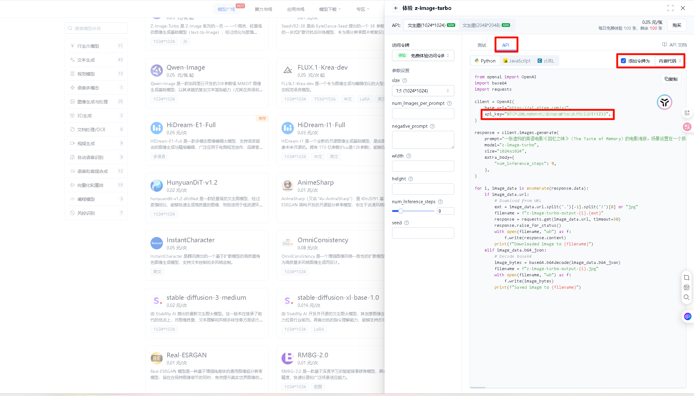

# 快速开始指南

本指南将帮助您快速安装和配置 AstrBot AI 图像生成插件。

## 目录

- [前置要求](#前置要求)
- [安装插件](#安装插件)
- [获取 API Key](#获取-api-key)
- [配置插件](#配置插件)
- [验证安装](#验证安装)
- [常见问题](#常见问题)

## 前置要求

在开始之前，请确保您已经：

- ✅ 安装了 [AstrBot](https://github.com/AstrBotDevs/AstrBot)（版本 2.8.0 或更高）
- ✅ 拥有 Gitee 账号
- ✅ 了解基本的命令行操作

## 安装插件

### 方法一：通过 AstrBot 插件市场安装（推荐）

1. 打开 AstrBot 管理后台
2. 进入「插件市场」页面
3. 搜索 `astrbot_plugin_models_ai`
4. 点击「安装」按钮
5. 等待安装完成

### 方法二：手动安装

1. 下载最新版本的插件压缩包
2. 将压缩包解压到 AstrBot 的 `data/plugins/` 目录下
3. 重启 AstrBot

### 方法三：通过 Git 克隆安装

```bash
cd /path/to/AstrBot/data/plugins/
git clone https://github.com/xiaomizhoubaobei/astrbot_plugin_models_ai.git astrbot_plugin_models_ai
```

## 获取 API Key

本插件使用 Gitee AI 平台的图像生成服务。您需要先获取 API Key 才能使用插件功能。

### 步骤 1：登录 Gitee AI 平台

1. 访问 [Gitee AI 官网](https://ai.gitee.com)
2. 点击右上角「登录」按钮
3. 使用您的 Gitee 账号登录（如果没有账号，请先注册）

### 步骤 2：进入 API 管理页面

登录成功后，按照以下步骤操作：

1. 点击页面右上角的头像，选择「个人中心」
2. 在左侧菜单中找到「API 管理」或「API Keys」选项
3. 点击进入 API 管理页面

### 步骤 3：创建新的 API Key

1. 在 API 管理页面，点击「创建 API Key」或「新建」按钮
2. 填写以下信息：
   - **名称**：为您的 API Key 起一个易于识别的名称（例如：`AstrBot-图像生成`）
   - **描述**（可选）：添加简短描述，例如：`用于 AstrBot 机器人生成图片`
   - **权限**：确保勾选「图像生成」或相关权限
3. 点击「确认」或「创建」按钮



### 步骤 4：复制 API Key

创建成功后，系统会显示您的 API Key：

```
sk-xxxxxxxxxxxxxxxxxxxxxxxxxxxxxxxxxxxxxxxx
```

**重要提示**：
- 🔐 **请立即复制并保存您的 API Key**，因为它只会在创建时显示一次
- 📝 将 API Key 保存在安全的地方，不要泄露给他人
- ⚠️ 不要将 API Key 提交到公共代码仓库

### 步骤 5：验证 API Key

您可以使用以下方法验证 API Key 是否有效：

```bash
curl -X POST "https://ai.gitee.com/v1/images/generations" \
  -H "Authorization: Bearer YOUR_API_KEY" \
  -H "Content-Type: application/json" \
  -d '{
    "model": "z-image-turbo",
    "prompt": "a beautiful sunset over the ocean",
    "n": 1,
    "size": "1024x1024"
  }'
```

将 `YOUR_API_KEY` 替换为您刚获取的 API Key。如果返回成功响应，说明 API Key 有效。

### API Key 使用限额

Gitee AI 平台对 API Key 有以下限制：


- **免费额度**：每个账号每月有一定的免费调用次数
- **速率限制**：每分钟/每小时有最大请求次数限制
- **并发限制**：同时进行的请求数量有限制

建议您在 Gitee AI 控制台查看具体的配额信息。

## 配置插件

安装插件并获取 API Key 后，需要在 AstrBot 中配置插件参数。

### 步骤 1：进入插件配置页面

1. 打开 AstrBot 管理后台
2. 进入「插件管理」页面
3. 找到 `astrbot_plugin_models_ai` 插件
4. 点击「配置」按钮

### 步骤 2：填写配置参数

在配置页面中填写以下参数：

#### 必填参数

| 参数名        | 说明                              | 示例                        |
|------------|---------------------------------|---------------------------|
| `api_keys` | Gitee AI API Key，支持多个 Key 用逗号分隔 | `sk-xxxxx,sk-yyyyy`       |
| `base_url` | API 基础地址（通常不需要修改）               | `https://ai.gitee.com/v1` |

#### 可选参数

| 参数名               | 说明      | 默认值             |
|-------------------|---------|-----------------|
| `model`           | 默认使用的模型 | `z-image-turbo` |
| `default_size`    | 默认图片尺寸  | `1024x1024`     |
| `negative_prompt` | 默认负面提示词 | （见下方说明）         |
| `inference_steps` | 推理步数    | `9`             |

#### 配置示例

```json
{
  "api_keys": "sk-xxxxxxxxxxxxxxxxxxxxxxxxxxxxxxxxxxxxxxxx",
  "base_url": "https://ai.gitee.com/v1",
  "model": "z-image-turbo",
  "default_size": "1024x1024",
  "negative_prompt": "low quality, bad anatomy, bad hands, text, error, missing fingers, extra digit, fewer digits, cropped, worst quality, normal quality, jpeg artifacts, signature, watermark, username, blurry",
  "inference_steps": 9
}
```

### 步骤 3：保存配置

填写完成后，点击「保存」按钮。系统会自动验证配置是否正确。

## 验证安装

配置完成后，您可以通过以下方式验证插件是否正常工作：

### 方法一：使用指令测试

在聊天中发送以下指令：

```
/ai-gitee generate 一只可爱的猫咪
```

如果插件正常工作，您将收到以下回复：

1. 「正在生成图片，请稍候...」
2. 几秒后收到生成的图片

### 方法二：查看日志

1. 打开 AstrBot 管理后台
2. 进入「日志」页面
3. 查找插件相关的日志，确认没有错误信息

### 方法三：使用帮助指令

发送以下指令查看插件帮助信息：

```
/ai-gitee help
```

## 常见问题

### Q: API Key 在哪里查看？

**A**: API Key 只在创建时显示一次，之后无法再次查看。如果忘记了，您需要删除旧的 Key 并创建新的。

### Q: 可以使用多个 API Key 吗？

**A**: 可以！在 `api_keys` 参数中，用逗号分隔多个 Key：

```
sk-xxxxx,sk-yyyyy,sk-zzzzz
```

插件会自动轮询使用这些 Key，提高调用成功率。

### Q: 如何查看 API 使用情况？

**A**: 登录 Gitee AI 平台，在个人中心可以查看 API 调用次数、剩余额度等信息。

### Q: 插件支持哪些图片尺寸？

**A**: 插件支持多种尺寸和比例，详见[支持的图像尺寸](image-sizes.md)文档。

### Q: 生成图片失败怎么办？

**A**: 请检查以下几点：

1. API Key 是否正确配置
2. API Key 是否有剩余额度
3. 网络连接是否正常
4. 查看插件日志获取详细错误信息

更多问题请参考[故障排除](troubleshooting.md)文档。

## 下一步

恭喜您完成了插件的安装和配置！现在您可以：

- 阅读[配置说明](configuration.md)了解更详细的配置选项
- 查看[使用指南](user-guide.md)学习如何使用各种功能
- 浏览[出图展示区](examples.md)获取灵感和提示词技巧

## 出图展示

以下是使用本插件生成的图片示例：


更多示例和提示词技巧请参考[出图展示区](examples.md)文档。

如有任何问题，欢迎在 [GitHub Issues](https://github.com/xiaomizhoubaobei/astrbot_plugin_models_ai/issues) 中提出。